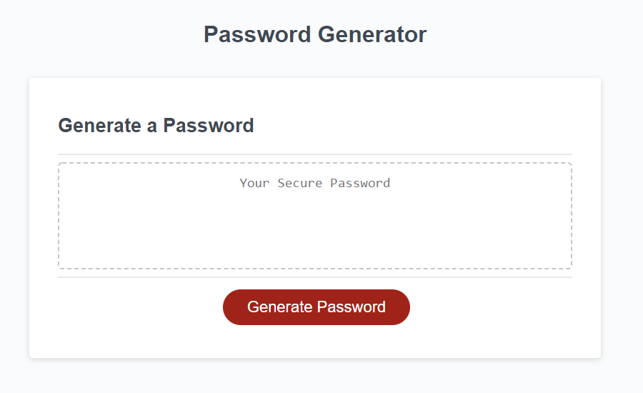

# Password Generator

[Deployed Site](https://dcrlsn.github.io/password-generator/)

## Table of Content

- [Usage](#Usage)
- [Description](#Description)

## Usage
When the user clicks the generate password button they are presented with a series of prompts. First they must choose a length between 8 and 128 characters for their password, then they are asked whether to include lowercase, uppercase, numeric, and/or special characters.

Once the user has selected a valid set of inputs the password text box will populate.

## Description
 The site uses a random number generator and criteria the user inputs to generate a password containing at least one of each of the characters the user selects
